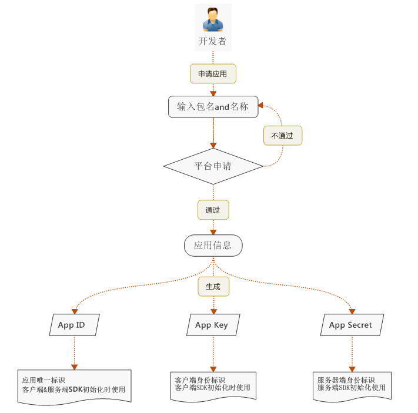
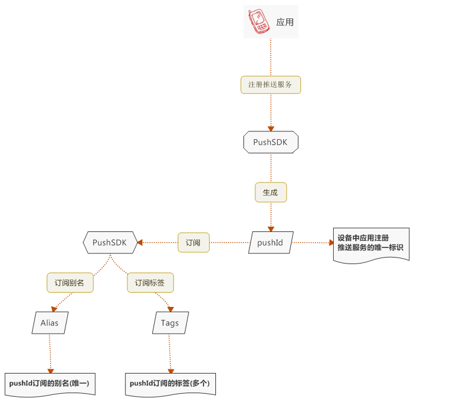
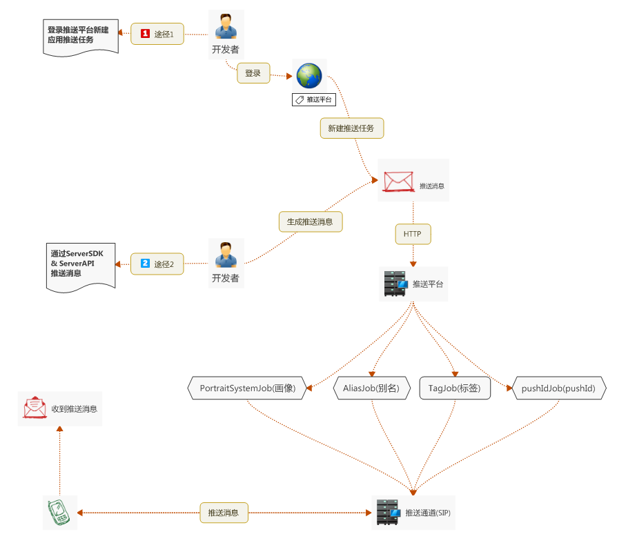

# 推送平台接入指南

[推送平台接入指南](http://open.res.flyme.cn/fileserver/upload/file/201612/728a49f530c64c5a832d7ba1de69e356.pdf)

### 应用注册流程

开发者通过Flyme开放平台进行开发者身份认证，认证通过后登录推送平台，填写应用名称以及应用包名进行应用注册，注册流程如下

### 设备订阅流程

应用注册成功后，通过PushSDK进行设备推送服务注册，分为pushId订阅、别名订阅、标签订阅，订阅流程如下

### 消息推送流程

完成应用注册以及设备订阅后，即可进入消息推送流程，推送途径分为平台推送和ServiceSDK推送，推送流程如下

